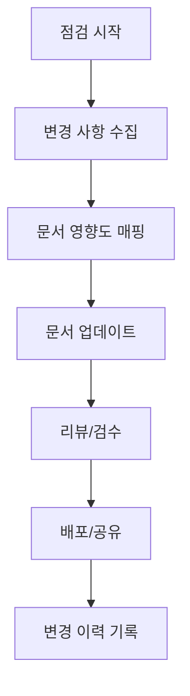

# docs 내부 파일 동기화 점검 계획

> 이 문서는 docs 폴더 전체 문서의 최신성, 상호 참조, 다이어그램 반영 상태를 정기적으로 점검하기 위한 내부 계획서입니다.

---

## 1. 목적

- 프로젝트 구조와 정책이 문서에 일관되게 반영되도록 유지
- 신규/변경 기능이 관련 문서에 누락 없이 반영되도록 보장
- 내부 온보딩 품질과 외부 공유 문서의 신뢰도 확보

---

## 2. 범위

- 전체 대상: `docs/` 하위 모든 문서
- 우선 대상: `docs/internal/`, `docs/shared/`
- 참고 대상: `docs/portfolio/`, `docs/ai/`, `docs/troubleshooting/`

---

## 3. 기준 문서 (Source of Truth)

| 기준 문서 | 역할 | 우선순위 |
|-----------|------|---------|
| `docs/internal/PROJECT-HANDBOOK.md` | 내부 종합 가이드 | 최상 |
| `docs/shared/Project-Structure.md` | 구조/스택 정의 | 상 |
| `docs/internal/CODING-CONVENTIONS.md` | 코드 규칙 | 상 |
| `docs/internal/patterns/` | 구현 패턴 | 상 |
| `docs/internal/adr/` | 결정 배경 | 상 |
| `docs/shared/API-specification.md` | API 명세 | 상 |

---

## 4. 동기화 규칙

1. **단일 출처 원칙**: 동일한 사실은 기준 문서 한 곳에만 상세 기록
2. **교차 참조 원칙**: 요약 문서에는 상세 문서 링크를 반드시 포함
3. **다이어그램 갱신**: 구조 변경 시 다이어그램과 텍스트를 함께 수정
4. **용어 통일**: 도메인명/컴포넌트명은 `docs/internal/PROJECT-HANDBOOK.md` 기준
5. **API/구현 분리**: 외부 공유 문서에는 내부 구현 세부사항 최소화

---

## 5. 점검 주기와 트리거

- **정기 점검**: 월 1회
- **이벤트 점검**
  - 신규 도메인 추가
  - 인증/인가 정책 변경
  - 캐시/메시지 큐 전략 변경
  - ADR 신규 등록 또는 폐기
  - 외부 공유 문서 변경

---

## 6. 점검 절차

---

## 7. 점검 체크리스트

| 항목 | 대상 문서 | 확인 방법 |
|------|----------|-----------|
| 프로젝트 구조 변경 | `docs/shared/Project-Structure.md` | 디렉터리/스택 목록 대조 |
| 보안 정책 변경 | `docs/internal/patterns/SECURITY-PATTERNS.md` | 설정/어노테이션 기준 확인 |
| 캐싱 전략 변경 | `docs/internal/patterns/CACHING-PATTERNS.md` | 캐시 키/TTL 점검 |
| 메시지 큐 변경 | `docs/internal/patterns/MESSAGE-QUEUE-PATTERNS.md` | Stream 구조/컨슈머 확인 |
| 예외 정책 변경 | `docs/internal/patterns/ERROR-HANDLING.md` | ErrorCode 목록 점검 |
| ADR 추가/폐기 | `docs/internal/adr/` | 결정 배경 반영 여부 확인 |
| 온보딩 문서 | `docs/internal/PROJECT-HANDBOOK.md` | 링크 누락/중복 점검 |
| 외부 공유 문서 | `docs/shared/` | 내부 정보 노출 여부 확인 |
| 벤치마크 문서 | `docs/internal/PERFORMANCE-BENCHMARK.md` | 최근 결과 반영 여부 |

---

## 8. 산출물

- 문서 업데이트 내역 요약 (날짜/변경 범위)
- 관련 ADR/패턴 문서 갱신 링크
- `docs/internal/PROJECT-AUDIT-GUIDE.md`에 체크 완료 기록

---

## 9. 책임과 역할

- **작성자**: 변경 기능을 담당한 개발자
- **리뷰어**: 도메인 오너 또는 기술 리드

---

## 10. 변경 이력

- 2026-01-29: 문서 동기화 점검 계획 최초 작성
