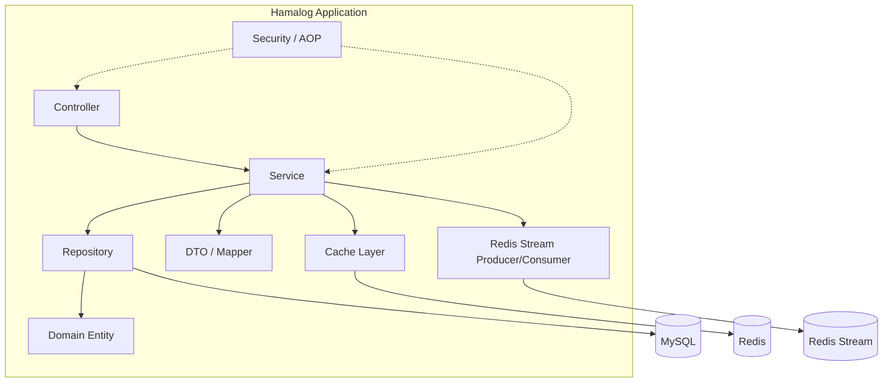
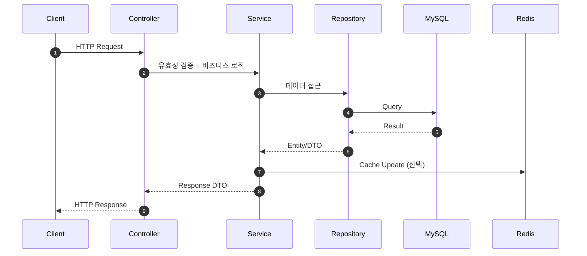
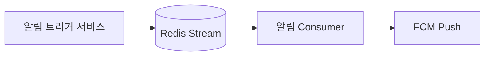

# Hamalog 내부 종합 가이드

> 이 문서는 Hamalog를 처음 접하는 내부 구성원이 프로젝트 구조와 전체 맥락을 빠르게 파악하도록 돕는 종합 안내서입니다.
> 세부 구현과 규칙은 각 문서 링크로 연결됩니다.

---

## 1. 프로젝트 요약

Hamalog는 복약 스케줄, 마음 일기, 부작용 기록을 통합 관리하는 Spring Boot 기반 헬스케어 백엔드입니다.

---

## 2. 시스템 컨텍스트

```mermaid
flowchart LR
    Client[Web/Mobile Client]
    API[Hamalog API
(Spring Boot)]
    DB[(MySQL)]
    Cache[(Redis Cache)]
    MQ[(Redis Stream)]
    FCM[FCM Push]
    CF[Cloudflare Tunnel]
    Nginx[Nginx]

    Client --> CF --> Nginx --> API
    API --> DB
    API --> Cache
    API --> MQ --> FCM
```

- 인프라/배포 상세: `docs/shared/Project-Structure.md`
- 보안 패턴 상세: `docs/internal/patterns/SECURITY-PATTERNS.md`

---

## 3. 컨테이너/컴포넌트 뷰



- 레이어 규칙: `docs/internal/CODING-CONVENTIONS.md`
- AOP/리소스 소유권: `docs/internal/patterns/ANNOTATION-GUIDE.md`

---

## 4. 핵심 흐름

### 4.1 요청-응답 흐름



- 예외 처리: `docs/internal/patterns/ERROR-HANDLING.md`
- 캐싱: `docs/internal/patterns/CACHING-PATTERNS.md`

### 4.2 알림 비동기 흐름



- 메시지 큐 패턴: `docs/internal/patterns/MESSAGE-QUEUE-PATTERNS.md`

---

## 5. 코드베이스 구조

- `src/main/java/com/Hamalog/` - 핵심 비즈니스 코드 (Controller, Service, Domain, Repository)
- `src/main/kotlin/com/Hamalog/` - Kotlin DTO/유틸리티
- `src/test/java/com/Hamalog/` - 테스트 (단위/통합/ArchUnit)
- `docs/` - 문서 허브 (공유/내부/포트폴리오)

상세 구조는 `docs/shared/Project-Structure.md`를 참고하세요.

---

## 6. 도메인 개요

- **복약 관리**: 스케줄, 기록, 알림 시간, 이행률 통계
- **마음 일기**: 일기 CRUD, 캘린더/통계
- **부작용 기록**: 부작용 및 기록, 조회/통계
- **회원/보안**: 인증/인가, 토큰, 로그인 이력
- **알림**: FCM, Redis Stream 기반 비동기 처리

상세 API는 `docs/shared/API-specification.md`를 참고하세요.

---

## 7. 보안/운영/성능 핵심

- **보안**: JWT + CSRF 이중 보호, 리소스 소유권 검증
  - 상세: `docs/internal/patterns/SECURITY-PATTERNS.md`
- **운영**: Docker, Nginx, Cloudflare Tunnel
  - 상세: `docs/shared/Project-Structure.md`
- **성능**: N+1 방지, 캐싱 전략, Redis Stream 비동기화
  - 상세: `docs/internal/patterns/JPA-PERFORMANCE.md`, `docs/internal/patterns/CACHING-PATTERNS.md`, `docs/internal/patterns/MESSAGE-QUEUE-PATTERNS.md`

---

## 8. 문서 지도 (전체 목록)

### 8.1 루트 문서

| 문서 | 대상 | 설명 |
|------|------|------|
| `docs/README.md` | 전체 | 문서 가이드 및 폴더 구조 |
| `docs/PORTFOLIO.md` | 면접관 | 상세 포트폴리오 |
| `docs/PORTFOLIO-SUMMARY.md` | 면접관 | 1페이지 요약 |
| `docs/GITHUB-PROJECT-CARD.md` | 전체 | GitHub 프로젝트 카드 |
| `docs/포트폴리오.md` | 내부 | 포트폴리오 보조 문서 |
| `docs/소프트웨어_개발보안_가이드(2021.12.29).pdf` | 내부 | 참고 보안 가이드 |

### 8.2 `shared/` (공유용)

| 문서 | 대상 | 설명 |
|------|------|------|
| `docs/shared/API-specification.md` | 프론트엔드 | REST API 명세 |
| `docs/shared/Project-Structure.md` | 전체 | 기술 스택, 디렉터리 구조 |
| `docs/shared/FUTURE-IMPROVEMENTS.md` | 전체 | 미구현 기능, 로드맵 |

### 8.3 `internal/` (내부 핵심)

| 문서 | 용도 |
|------|------|
| `docs/internal/PROJECT-HANDBOOK.md` | 내부 종합 가이드 |
| `docs/internal/PROJECT-OVERVIEW.md` | 내부 온보딩 요약 |
| `docs/internal/CODING-CONVENTIONS.md` | 코딩 컨벤션 |
| `docs/internal/KOTLIN-GUIDE.md` | Kotlin 문법 가이드 |
| `docs/internal/API-reference.md` | 인프라/DB/변경 이력 |
| `docs/internal/PROJECT-AUDIT-GUIDE.md` | 점검 체크리스트 |
| `docs/internal/IMPROVEMENT-TASKS.md` | 개선 태스크 |
| `docs/internal/DECISION-TROUBLESHOOTING-GUIDE.md` | 결정/트러블슈팅 가이드 |
| `docs/internal/DOCS-SYNC-PLAN.md` | 문서 동기화 점검 계획 |
| `docs/internal/GITHUB-SECRETS-GUIDE.md` | GitHub Secrets 설정 |
| `docs/internal/AUDIT-REPORT-20260120.md` | 점검 결과 보고서 |
| `docs/internal/PRACTICAL-EVALUATION-REPORT.md` | 실무 평가 보고서 |

### 8.4 `internal/adr/` (아키텍처 결정 기록)

| 문서 | 내용 |
|------|------|
| `docs/internal/adr/0001-adr-template.md` | ADR 작성 가이드 |
| `docs/internal/adr/0002-jwt-csrf-dual-protection.md` | JWT + CSRF 이중 보호 |
| `docs/internal/adr/0003-aop-cross-cutting-concerns.md` | AOP 횡단 관심사 |
| `docs/internal/adr/0004-domain-event-pattern.md` | Domain Event 패턴 |
| `docs/internal/adr/0005-redis-cache-strategy.md` | Redis 캐시 전략 |
| `docs/internal/adr/0006-sensitive-data-encryption.md` | 민감 데이터 암호화 |
| `docs/internal/adr/0007-message-queue-redis-stream.md` | Redis Stream 메시지 큐 |

### 8.5 `internal/patterns/` (선언적 패턴)

| 문서 | 내용 |
|------|------|
| `docs/internal/patterns/ANNOTATION-GUIDE.md` | 커스텀 어노테이션 |
| `docs/internal/patterns/ERROR-HANDLING.md` | 에러 처리 패턴 |
| `docs/internal/patterns/SECURITY-PATTERNS.md` | 보안 패턴 |
| `docs/internal/patterns/CACHING-PATTERNS.md` | 캐싱 패턴 |
| `docs/internal/patterns/JPA-PERFORMANCE.md` | JPA 성능 최적화 |
| `docs/internal/patterns/MESSAGE-QUEUE-PATTERNS.md` | 메시지 큐 패턴 |

### 8.6 성능/벤치마크 문서

| 문서 | 내용 |
|------|------|
| `docs/internal/PERFORMANCE-BENCHMARK.md` | 벤치마크 결과 |
| `docs/internal/BENCHMARK-COMMANDS.md` | 실행 명령어 |
| `docs/internal/BENCHMARK-LOCAL-STRATEGY.md` | 로컬 전략 |
| `docs/internal/BENCHMARK-CACHE-PLAN.md` | 캐시 계획 |

### 8.7 `portfolio/` (기술적 도전 심층 분석)

| 문서 | 핵심 주제 |
|------|-----------|
| `docs/portfolio/README.md` | 포트폴리오 문서 목록 |
| `docs/portfolio/01-jwt-csrf-protection.md` | SPA 환경 CSRF 방어 |
| `docs/portfolio/02-aop-resource-ownership.md` | 선언적 보안 |
| `docs/portfolio/03-jpa-n-plus-one.md` | 쿼리 최적화 |
| `docs/portfolio/04-sensitive-data-encryption.md` | 민감 데이터 암호화 |
| `docs/portfolio/05-optimistic-locking.md` | 낙관적 락 |
| `docs/portfolio/06-redis-stream-queue.md` | Redis Stream 큐 |
| `docs/portfolio/07-redis-cache-consistency.md` | 캐시 정합성 |
| `docs/portfolio/08-rate-limiting.md` | 요청 제한 |
| `docs/portfolio/09-archunit-architecture-test.md` | 아키텍처 테스트 |

### 8.8 `ai/` (AI 협업)

| 문서 | 용도 |
|------|------|
| `docs/ai/ARCHITECTURE-DIAGRAM-PROMPT.md` | 아키텍처 다이어그램 생성 프롬프트 |
| `docs/ai/VIBE-CODING-GUIDE.md` | AI 협업 가이드 |

### 8.9 `troubleshooting/` (문제 해결)

| 문서 | 용도 |
|------|------|
| `docs/troubleshooting/README.md` | 트러블슈팅 인덱스 |

---

## 9. 읽기 순서 (내부 온보딩)

1. `docs/internal/PROJECT-HANDBOOK.md` - 전체 맥락
2. `docs/shared/Project-Structure.md` - 구조/스택
3. `docs/internal/PROJECT-OVERVIEW.md` - 요약 재확인
4. `docs/internal/CODING-CONVENTIONS.md` - 코드 규칙
5. `docs/internal/patterns/` - 보안/캐시/에러/성능 패턴
6. `docs/internal/adr/` - 결정 배경

---

## 10. 문서 동기화 원칙

- 문서 간 내용 충돌을 방지하기 위해 동기화 규칙을 유지합니다.
- 점검 절차는 `docs/internal/DOCS-SYNC-PLAN.md`에 정의합니다.

---

## 11. 변경 이력

- 2026-01-29: 내부 종합 가이드 최초 작성
