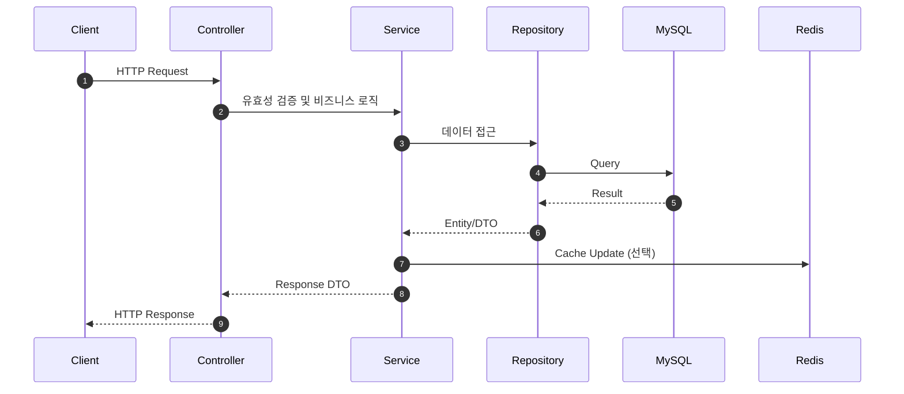

# Hamalog 내부 프로젝트 개요

> 이 문서는 Hamalog를 처음 접하는 내부 구성원을 위한 전체 구조 안내서입니다.
> 세부 문서는 링크로 연결되어 있으므로 필요한 부분을 빠르게 찾아갈 수 있습니다.

---

## 1. 프로젝트 한줄 요약

Hamalog는 복약 스케줄, 마음 일기, 부작용 기록을 통합 관리하는 Spring Boot 기반 헬스케어 백엔드입니다.

---

## 2. 시스템 구성 (Context)

```mermaid
flowchart LR
    Client[Web/Mobile Client]
    API[Hamalog API
(Spring Boot)]
    DB[(MySQL)]
    Cache[(Redis)]
    MQ[(Redis Stream)]
    FCM[FCM Push]
    CF[Cloudflare Tunnel]
    Nginx[Nginx]

    Client --> CF --> Nginx --> API
    API --> DB
    API --> Cache
    API --> MQ --> FCM
```

- 인프라/배포 구성은 `docs/shared/Project-Structure.md` 참고
- 운영/보안 패턴은 `docs/internal/patterns/SECURITY-PATTERNS.md` 참고

---

## 3. 코드베이스 구조 (Directory Map)

핵심 소스 루트와 레이어 구조는 다음 문서에 정리되어 있습니다.

- 상세 구조: `docs/shared/Project-Structure.md`
- 코딩 규칙: `docs/internal/CODING-CONVENTIONS.md`

핵심 디렉터리 요약:

- `src/main/java/com/Hamalog/` - 핵심 비즈니스 코드 (Controller, Service, Domain, Repository)
- `src/main/kotlin/com/Hamalog/` - Kotlin DTO/유틸리티
- `src/test/java/com/Hamalog/` - 테스트 (ArchUnit 포함)
- `docs/` - 문서 허브 (공유/내부/포트폴리오)

---

## 4. 도메인 개요 (Business Domains)

- **복약 관리**: 스케줄, 기록, 알림 시간, 이행률 통계
- **마음 일기**: 일기 CRUD, 캘린더/통계
- **부작용 기록**: 부작용 및 기록, 조회/통계
- **회원/보안**: 인증/인가, 토큰, 세션/로그인 이력
- **알림**: FCM, Redis Stream 기반 비동기 처리

도메인별 상세 구조 및 API는 다음 문서를 참고하세요.

- API 스펙: `docs/shared/API-specification.md`
- 구현 규칙: `docs/internal/patterns/` 하위 문서

---

## 5. 주요 흐름 (Request Flow)



- 예외 처리: `docs/internal/patterns/ERROR-HANDLING.md`
- 캐싱: `docs/internal/patterns/CACHING-PATTERNS.md`
- 성능: `docs/internal/patterns/JPA-PERFORMANCE.md`

---

## 6. 보안/운영/성능 요약

- **보안**: JWT + CSRF 이중 보호, 리소스 소유권 검증
  - 상세: `docs/internal/patterns/SECURITY-PATTERNS.md`
- **운영**: Docker, Nginx, Cloudflare Tunnel
  - 상세: `docs/shared/Project-Structure.md`
- **성능**: N+1 방지, 캐싱 전략, Redis Stream 비동기화
  - 상세: `docs/internal/patterns/JPA-PERFORMANCE.md`, `docs/internal/patterns/CACHING-PATTERNS.md`, `docs/internal/patterns/MESSAGE-QUEUE-PATTERNS.md`

---

## 7. 문서 맵 (빠른 진입)

### 필수 읽기

1. `docs/shared/Project-Structure.md` - 전체 구조
2. `docs/internal/CODING-CONVENTIONS.md` - 코딩 규칙
3. `docs/internal/patterns/` - 구현 패턴

### 문제 해결/의사결정

- `docs/internal/adr/` - 아키텍처 결정 기록
- `docs/internal/DECISION-TROUBLESHOOTING-GUIDE.md` - 결정/트러블슈팅 가이드

### 성능/품질

- `docs/internal/PERFORMANCE-BENCHMARK.md` - 성능 벤치마크 결과
- `docs/internal/PROJECT-AUDIT-GUIDE.md` - 프로젝트 점검 가이드

### 포트폴리오 심층 분석

- `docs/portfolio/README.md` - 기술적 도전 요약

---

## 8. 변경 이력

- 2026-01-28: 내부 온보딩용 개요 문서 최초 작성
